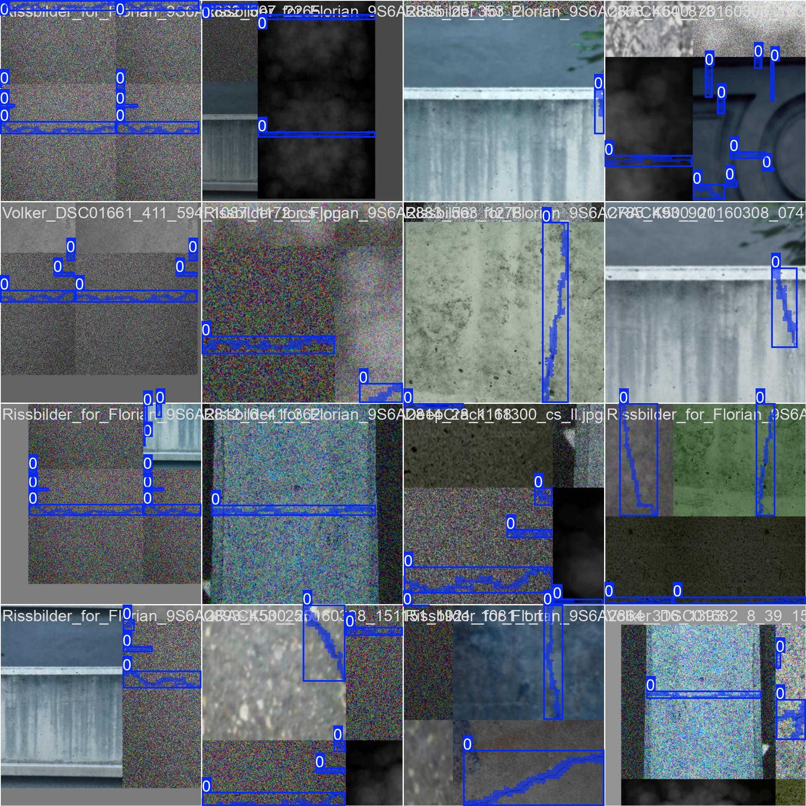

# Underwater Crack Detection using YOLO

## Introduction
This project demonstrates **underwater crack detection** using the **YOLO (You Only Look Once) object detection framework**. 
The pipeline processes underwater images to detect cracks, generates corresponding **mask images**, and visualizes the detected regions with **bounding boxes**. It is designed to be easy to run locally with a pre-trained YOLO model. This model can be used to automatically detect cracks in underwater concrete structures, such as dams, bridges, and offshore platforms, enabling fast and safe structural inspections without the need for human divers.

---

## Dataset Preparation and Augmentation

The dataset used for training is located in ```https://www.kaggle.com/datasets/lakshaymiddha/crack-segmentation-dataset```

Since it was not primarily for underwater crack detection, we augmented the dataset using the following parameters:

## Image Augmentations

To improve model robustness, the following image augmentations are applied:

- **Blur**
  - `GaussianBlur`: Applies a soft blur with kernel size 3×3 to 9×9, simulating out-of-focus images.
  - `MotionBlur`: Simulates motion blur caused by camera or object movement (kernel size up to 7).

- **Turbidity**
  - `RandomFog`: Adds fog-like distortion to simulate underwater or misty conditions. Controlled by fog intensity and blending parameters.

- **Low Light**
  - `RandomBrightnessContrast`: Randomly darkens images and reduces contrast to simulate poor lighting or shadowed areas.

- **Color Shift**
  - `RGBShift`: Shifts the red, green, and blue channels independently to simulate lighting or camera sensor variations.
  - `HueSaturationValue (HSV Shift)`: Randomly adjusts hue, saturation, and brightness to generalize across different color conditions.

- **Noise**
  - `GaussNoise`: Adds Gaussian noise to simulate sensor noise or low-quality camera captures.

> These augmentations make the model robust to blurred, dark, noisy, color-shifted, and foggy/turbid images, which are common in real-world or underwater scenarios.

## Requirements

Before running the code, make sure you have the following libraries installed:

```bash
pip install ultralytics opencv-python numpy
```
Ensure you have Python 3.8 or higher installed.

## Setup

Update `paths.py` accordingly to make sure the paths match your local directories.

Add your test images to the `test_images/` folder

## Run

```bash
python run_inference.py
```

## Project Structure

```
tree_plantation/                  <- BASE_DIR
│
├── models/                        <- Store models here
│   ├── best.pt                    <- YOLOv8n trained model
│
├── test_images/                   <- Input images for inference
│   ├── image1.jpg
│   └── ...
│
├── output_masks/                  <- Masked output images
├── output_bbox/                   <- Images with bounding boxes
├── paths.py                       <- Configure file paths
└── run_inference.py               <- YOLO detection script
```

## Sample Results

These are the validation result images below:


